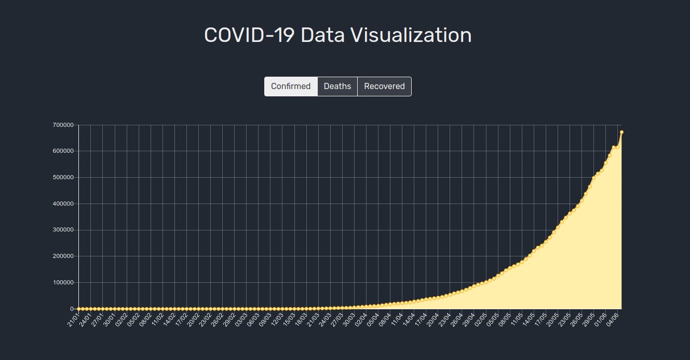

# Covid-19 Data Visualization

Gráfico com os dados do Brasil.

## Desenvolvido com

* [Vue.js](https://vuejs.org/)
* [Bootstrap](https://getbootstrap.com/)
* [Chart.js](https://www.chartjs.org/)
* [COVID19 API](https://covid19api.com/)

## Referência

* [Building a COVID-19 Dashboard with Vue.js and Chart.js - Diligent Dev](https://www.youtube.com/watch?v=cUSfL6MBmlY)

## Screenshot

